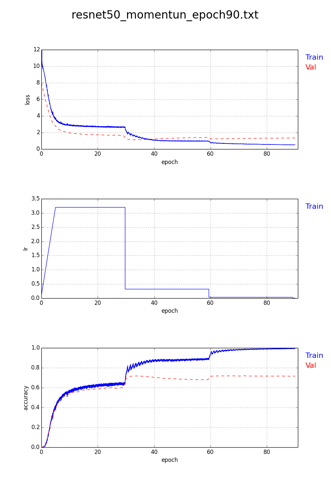

# plot\_digits\_output

### *Digits log output Parser*

#### command:

<code>python plot.py [filename]</code>

#### This program find either strings of below in every line:

* [INFO] Training
* [INFO] Validation

#### If found, it will catch four parameters in the line, and store them into train or val dictionary.

* lr = *[%d.%d]*
* accuracy = *[%d.%d]*
* loss = *[%d.%d]*
* epoch *[%d.%d]*

#### Finally, polling those two dictionary, and output PNG figure like this:

  

